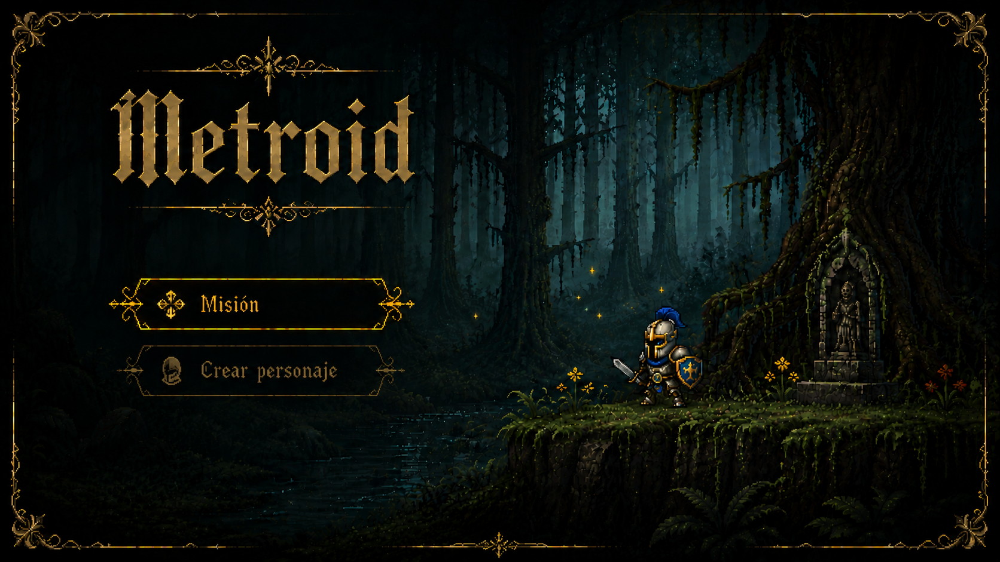
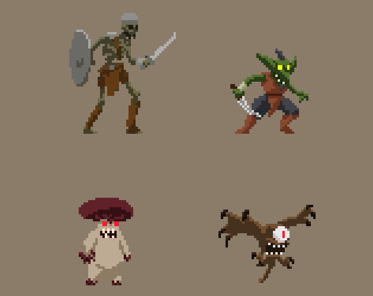

# README, Tareas y requerimientos del desarrollo de 'Metroid' 🎲🎴
---

## Introducción
Todo esto debería hacerlo en ingles pero no tengo ganas.
Este es un repo en el cuál estoy desarrollando "Metroid" (tampoco me maté con el nombre).

Metroid es un videojuego de estilo, valga la redundancia, *Metroidvania* desarrollado en 
***C++ /SFML***

Es un RPG con una modalidad de misiones. Se elige a un personaje dentro de una selección de 3: 
Un caballero/dos (porque no me decidi cual meter aún), y probablemente un hechicero Y un clérigo (el departamento de diseño gráfico consiguió bocetos pero no busco ningún sprite real por internet).

Todo el juego está diseñado para ser keyboard-only, asi q no me rompan con la combatibilidad para mouse pq sino no llego más a ponerle un backend a este mutante.

La mecanica Básica que se esta desarrollando es un menú bastante amigable el cual nos deja seleccionar 2 opciones:
    1. **Realizar Misión**
    2. **Creación de personaje** (deberia ser selección, disputas pendientes con el departamento de diseño gráfico).

Adjunto imagen de muestra:

En la mecánica "Misión" se esta desarrollando en una versión prematura del proyecto, una misión que suceda en diferentes escenarios de forma aleatoria.

Escenarios en los cuáles nuestro personaje se encontrará, también aleatoriamente, con distintos mobs (goblins, esqueletos guerreros -warrior skeletons u hongos malvados -baddie mushrooms).

Cada Mob tiene animaciones distintas, al igual que cada uno de los 3 main characters que van a ser posibles de elegir:

Cuando se entra a una misión, el usuario puede elegir lo que pase según los eventos internos del juego:
1. Si *Aparece un Mob*, se podrá decidir enfrentarlo como no hacerlo, volviendo por donde se vino y respawneando en el menú.
    - Si se entra en combate, aleatoriamente se puede morir del daño como matar al mob (esto con sus respectivas animaciones disponibles en /ASSETS).
2. Si no aparece un mob, aparece un tesoro, el tesoro supongo que en algo va a beneficiar al personaje (disputas pendientes con el departamento creativo)
---

## 📍 Responsabilidades del desarrollo
### 👨‍💻 Bernal Santino (github: wberni)
- Desarrollo completo de lógica, mecanica y código
- Dirección Creativa
- Implementación de organización del proyecto, toma de desiciones.
### 🎨 Berraquero Tiziano (colab.)
- Bocetos iniciales de menú, backgrounds.
- Colaborador en la lluvia de ideas y diseño conceptual del proyecto
---

## El código anda necesitando algunas cositas:
1. En `class_Game.h` tengo un ***'resourceManager'*** que me permite añadir textura/sprites con ***addResource(img_path)*** y tomar el sprite con un ***getSprite(img_path)***:
    - **Pero falta un 'audioManager' que me permite controlar las mismas cosas con _Audios_:** que me permita añadir audios con metodo ***addAudio(audio_path)*** y tomar el audio con ***getAudio(audio_path)***.
2. Falta añadir un archivo **README** de documentación de como funciona el código, que intenta hacer y como usarlo. Creo que voy a integrar un README ***básico*** cuando sea esto:
    -  ***Un menú interactivo que cambie entre 2 imagenes:***
        1. Selección de opción 1 [Misión]
        2. Selección de opción 2 [Creación de Personaje]

2. Y luego mejorar el proyecto hasta que con esta hermosa arquitectura del codigo que me estoy mandando, se tenga la base DEFINITIVA:
    - ***Un menú interactivo funcional entre 2 opciones, con un fondo fijo, y que el -cómo- se muestre la selección sea con un sprite de marco que cambie posición según eventos.*** 

---

## Si alguien esta leyendo esto que no sea yo:
1. Buen dia y toma agua.
2. El MAKEFILE esta diseñado para ser compilado con MSYS2 o Git Bash, asi q si usas CMD probablemente
necesites modificarlo para compilarlo bien.
3. Si queres hechar un vistazo muy rapido a la forma que va tomando esto, ejecuta el archivo 
`try.exe` que se encuentra dentro de **/build**.

